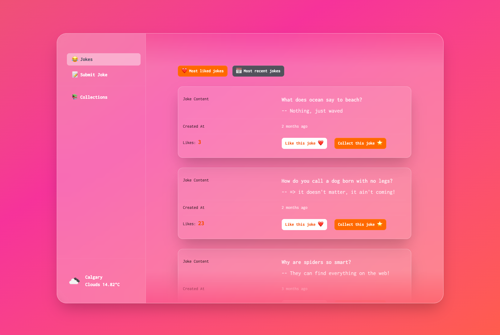
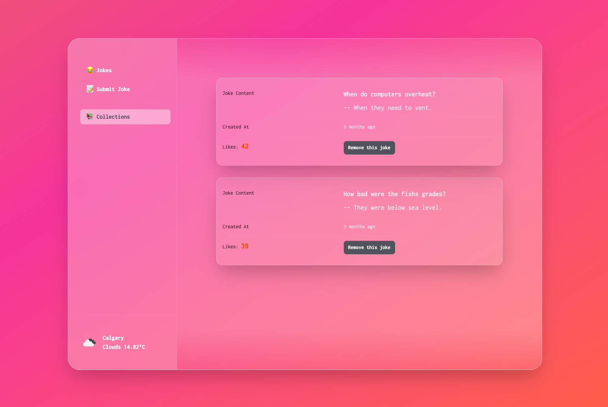

# Jokes Share (React)

Frontend for **Jokes Share**, a small web app for browsing, liking, and submitting jokes. This repository is the React single-page application that talks to a jokes RESTful API and includes a extra page for weather function to show the current weather of Calgary city.

## Live Site

[https://owenouyang.com](https://owenouyang.com)

<p align="center">
  
  
</p>

## Features

- **Jokes feed** — Load jokes from the backend, sort by most liked or most recent, and like jokes with optimistic UI updates.
- **Submit a joke** — Post new joke text to the API and return to the feed on success.
- **Collections** — Save jokes locally in the browser (persisted with Zustand) and remove them from your collection.
- **Weather** — Page that loads current weather (default city: Calgary) for a simple data-fetching example.

## Tech stack

- [React 19](https://react.dev/)
- [React Router 7](https://reactrouter.com/) (layout + nested routes)
- [Tailwind CSS v4](https://tailwindcss.com/) via `@tailwindcss/vite`
- [Axios](https://axios-http.com/) for HTTP
- [Zustand](https://zustand-demo.pmnd.rs/) with immer middleware for persistence for collections
- [dayjs](https://day.js.org/), [lodash](https://lodash.com/), [Motion](https://motion.dev/), [Headless UI](https://headlessui.com/), [react-toastify](https://fkhadra.github.io/react-toastify/)

UI primitives live under `src/components/` (buttons, forms, layout, etc.).

## Prerequisites

- **Node.js** (current LTS recommended)
- A running **jokes API** that matches the endpoints below (or adjust the client to your API)

## Configuration

Create a `.env` file in the project root and set:

| Variable        | Description                                              | Default                      |
| --------------- | -------------------------------------------------------- | ---------------------------- |
| `JOKES_API_URL` | Base URL for the jokes backend (trailing slash optional) | `http://localhost:3000/api/` |

The Axios instance is created in `src/apis/http.jsx`.

## Backend API (expected shape)

The client assumes a REST API with at least:

- `GET /jokes` — Returns a list of jokes (fields used in the UI include `joke_id`, `content`, `like_count`, `joke_created_at`).
- `POST /jokes` — Body: `{ "content": "..." }` — Creates a joke.
- `POST /jokes/:jokeId/like` — Increments a like; response should include a `message` string (shown in a toast).

## Scripts

```bash
npm install
npm run dev      # start Vite dev server
npm run build    # production build to dist/
npm run preview  # serve the production build locally
npm run lint     # ESLint
```

## Project layout

```
src/
  apis/          # HTTP helpers (jokes, weather, etc.)
  components/    # Reusable UI
  pages/         # Route-level screens
  router/        # Browser router definition
  stores/        # Zustand stores (e.g. persisted collections)
  main.jsx       # App entry
```
